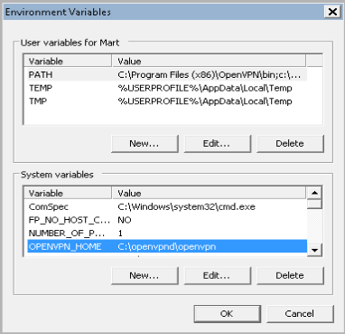
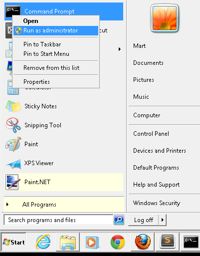
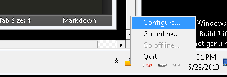
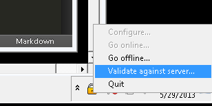
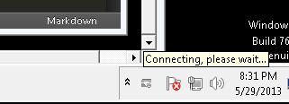
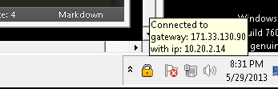

# Greenhost OpenVPN client monitor for windows

This software was designed to be a simple way to control OpenVPN on windows machines
giving accurate feedback about the connection state. The software is composed of two
interdependent programs.

> WARNING: At the time of this writing this software is still in ALPHA state.
> There is no installer and some manual work is required to install and start the 
> windows service. The windows installer to automate all this should be ready soon.

## The windows service

The windows service is the one in charge of opening the connection to the VPN and closing it as well as monitoring its state. To do this OpenVPN and the TAP-Windows driver included in the package must be installed.

#### Pre-requisites
Install TAP Windows from the client distribution by double-clicking on the installer.

To let the monitor know where the OpenVPN client is, you must have a system-wide environment variable called *OPENVPN_HOME* that points to the folder where your OpenVPN installation is. Make sure this variable is available to all users, not only to your current user.

#### Installation
To install the windows service you will need to open a *Command Prompt* in *Administrator mode*. For this go to your windows menu, right click on the *Command Promp* and select the item labeled as *Run as administrator*.

Once you are at the command prompt, go to the directory where you unpacked the supplied .ZIP file and go into the *service* folder and run the following commands:

> c:\unpacked-zip\service> **ovpnmon -install**

This will install the service in your windows machine. To start the service type:

> c:\unpacked-zip\service> **net start ovpnmon**

**ovpnmon** by the way is the name of the service. If you open your Windows Task Manager and go to the *services* tab you should see it listed there.

From the previous command you should get the following output:

<code>
	The OVPN monitor service is starting.
	The OVPN monitor service was started successfully.
</code>

## The systray gui

Once you start this application it will sit rather quietly in your system tray until you stablish the connection. You do not have to install this one, it is a self-standing executable. You may place it in your *Start Up* items if you wish to have it available upon startup.

Choose **Configure...** to set the configuration file provided by your VPN administrator. This configuration file will be used in every subsequent connection.

> The GUI client provides a way to validate the VPN connection against a preconfigured server 
> inside of the VPN. This is useful as a double check, but please be mindful that this is not 
> foolproof and if your network has been compromised it would be easy to fool the browser with a 
> fake page. So trust only what the system tray icon says.

When you click on *Go online...* the client will take a few seconds to initialize the connection. Please wait untill your connection is secured.

You are now connected to the VPN. Plase validate the IP address of the gateway and the address of your interface, to make absolutely sure that your connection is secured.

