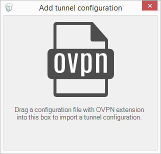
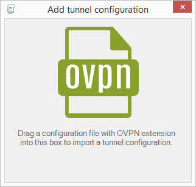
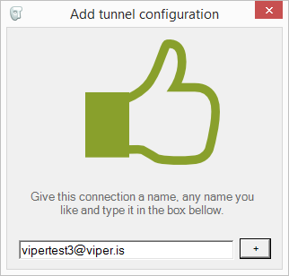

# Viper 1.0 (beta)
Viper is Windows OpenVPN client software designed for Internet access over an VPN connection.

> WARNING: At the time of this writing this software is still in a BETA 
> development state. It is very well possible that bugs might still lurk
> in unknown places. 

## New in this release
- Revamped the architecture of Viper. The Windows service that serves as connection guard is now HTTP enabled and includes a REST/JSON api that enables any client to interact with the connection guard.
- Created a new Windows-native GUI client that has a smaller footprint and improved UX.

## Installation
The installer will carry out the installation of all the necessary components used by Viper. This includes the TAP/TUN networking driver for Windows, an OpenVPN binary, a service that runs with elevated privileges that is the heart of Viper and will guard your connection, set firewall policies, start and stop the VPN, etc. And last but not least a GUI client that will allow you to interact with the connection guard.

## First look
Open the GUI client and spend some time getting familiar with the user GUI.

#### Configuring Viper
Viper needs a configuration file containing connection details and all the pertinent certificates to allow for a secure connection. You can request this configuration file from your VPN administrator or fetch it from the Uman VPN web interface. This file should have the `.ovpn` extension, once you have this file installing it with Viper is very easy.

To configure Viper you first have to run the GUI client and click in the `Add tunnel...` button, a small window with a big icon will appear.

Open the folder where you stored the `.ovpn` files that you just got and drag this file to the window. If Viper recognizes this file as a valid configuration the icon in the window will turn green.

When you drop the file, you will be asked to name that connection profile. This is a name that will allow you to remember which provider is giving you this connection.

### Recommendations
If Viper finds the *Windows Firewall* active it will automatically configure it to block unnecesary traffic outside the tunnel. The current release of Uman/Viper doesn't support IPv6, so all IPv6 traffic will be blocked.

If you run Viper with your *Windows Firewall* disabled it will warn you about it, so that you can manually enable it before you continue. Viper will not work properly is the *Windows Firewall* is disabled.

>If your personal integrity depends on a secured
> internet connection, we remind you that it is not wise to trust your life 
> to any piece of software, so use Viper with utmost care.

### What happens if the connection is lost?
Sometimes it can happen that connection to the VPN gateway is momentarily lost. Most times it will be back up before you notice, so this shouldn't be a problem. If the problem persist it will appear to you as if your connection to the internet has been dropped completely. Even if your colleagues in the same network can connect to the internet, you will not be able to. This is by design.

**Viper acts as a guard for your internet connection while it's active and it will not let you connect to the internet unless your connection is secured**. If Viper is active and your connection isn't secured, it will seem to you like you are offline.

## Troubleshooting
Viper beta releases produce a log file located in the root directory of your Windows drive. This file is named `ovpnmon.log`.

When reporting bugs it is generally a good idea to include this log file, this will allow us to diagnose the problem and fix it more quickly.

## Help out
You can help the developers of Viper by testing the software and sending reports of any bugs you might find. If you wish to hack at the code and perhaps even join the development, please refer to the development section at the `CONTRIBUTING`.

## Future
We would like to make Viper a good VPN client for people that work in environments were best practices in security are routine. We would very much appreciate to hear your use cases if they are not contemplated by Viper, to gain more experience from the field.

In future releases we would like to focus on responsiveness, auto-configuration and self-updating.
